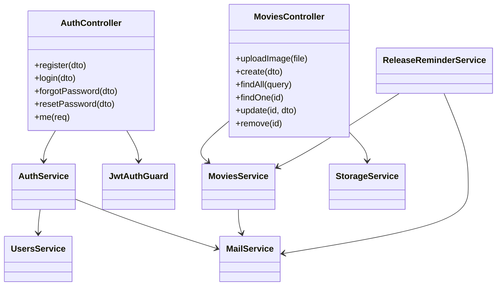
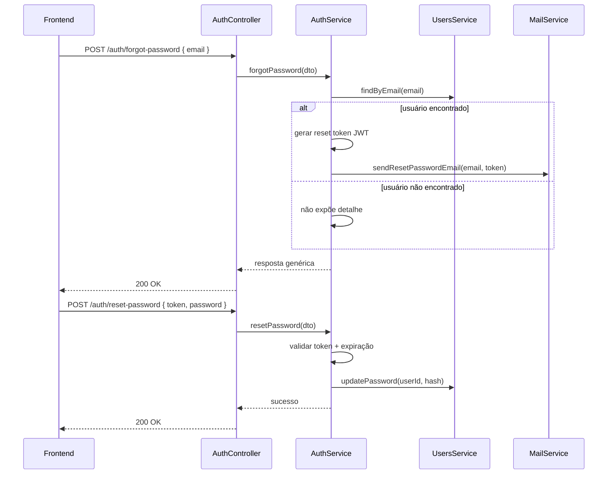

# Backend - Cubos Movies API

API REST responsável por autenticação, gerenciamento de filmes, upload de imagens e envio de e-mails transacionais.

## Stack técnica

- Framework: NestJS 11
- Linguagem: TypeScript
- Persistência: TypeORM + PostgreSQL
- Autenticação: JWT + Passport
- Validação: class-validator + class-transformer
- E-mail: Nodemailer/Resend
- Storage: AWS S3 ou Cloudflare R2
- Testes: Jest + Supertest

## Arquitetura por módulos

- `auth`: registro, login, me, forgot/reset password.
- `movies`: CRUD, paginação/filtros e upload.
- `mail`: abstração de envio de e-mails.
- `database`: configuração de conexão TypeORM.
- `common`: utilitários compartilhados, templates e tratamento de erros.

## UML - visão estrutural (módulos e serviços)



## UML - sequência do fluxo de recuperação de senha



## Como executar

### Pré-requisitos

- Node.js >= 20
- npm >= 10
- PostgreSQL disponível (local ou Docker)

### Instalação

```bash
npm install
```

### Configuração de ambiente

Copie o arquivo de exemplo:

Linux/macOS:

```bash
cp .env.example .env
```

Windows PowerShell:

```powershell
Copy-Item .env.example .env
```

### Execução

```bash
# desenvolvimento
npm run start:dev

# build + produção
npm run build
npm run start:prod
```

## Endpoints principais

Auth:

- `POST /auth/register`
- `POST /auth/login`
- `POST /auth/forgot-password`
- `POST /auth/reset-password`
- `GET /auth/me` (autenticado)

Movies (autenticado):

- `POST /movies/upload` (multipart/form-data, campo `file`)
- `POST /movies`
- `GET /movies?page=1&limit=10&search=...&genre=...`
- `GET /movies/:id`
- `PATCH /movies/:id`
- `DELETE /movies/:id`

## Contratos relevantes

- Paginação de listagem: `page`, `limit`, `search`, `genre`.
- Criação de filme: `title`, `description`, `releaseDate`, `budget`, opcionais `imageUrl`, `trailer`, `genres`, `durationMinutes`.

## Variáveis de ambiente

### Banco

- `DB_HOST`
- `DB_PORT`
- `DB_USER`
- `DB_PASSWORD`
- `DB_NAME`

### Autenticação

- `JWT_SECRET`
- `JWT_EXPIRES_IN`
- `JWT_RESET_SECRET`
- `JWT_RESET_EXPIRES_IN`
- `FRONTEND_URL`

### E-mail

- `RESEND_API_KEY`
- `MAIL_FROM`

### Storage

- `STORAGE_PROVIDER` (`s3` ou `r2`)

S3:

- `AWS_ACCESS_KEY_ID`
- `AWS_SECRET_ACCESS_KEY`
- `AWS_REGION`
- `AWS_S3_BUCKET`
- `AWS_S3_PUBLIC_BASE_URL` (opcional)

R2:

- `R2_ACCESS_KEY_ID`
- `R2_SECRET_ACCESS_KEY`
- `R2_ACCOUNT_ID` ou `R2_ENDPOINT`
- `R2_BUCKET`
- `R2_PUBLIC_BASE_URL` (obrigatório)

## Qualidade e testes

```bash
npm run lint:check
npm run test:ci
npm run test:e2e
npx tsc --noEmit
```

## Troubleshooting rápido

- Erro ao subir API: valide `.env` e conexão com PostgreSQL.
- Porta ocupada: altere `PORT` temporariamente.
- E-mail não enviado: valide `RESEND_API_KEY` e `MAIL_FROM`.
