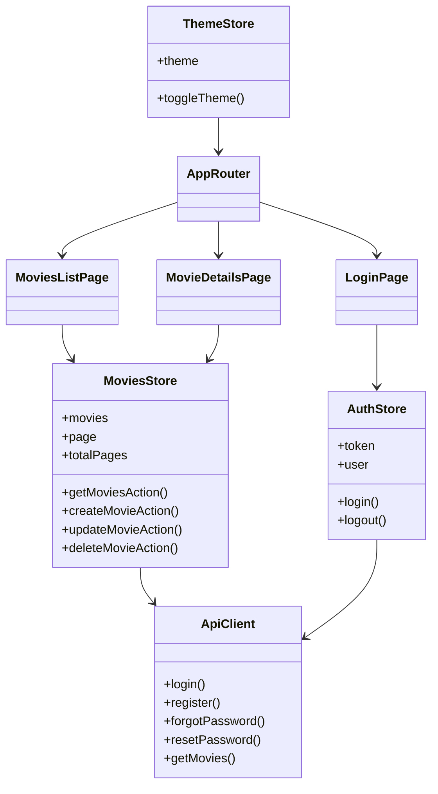
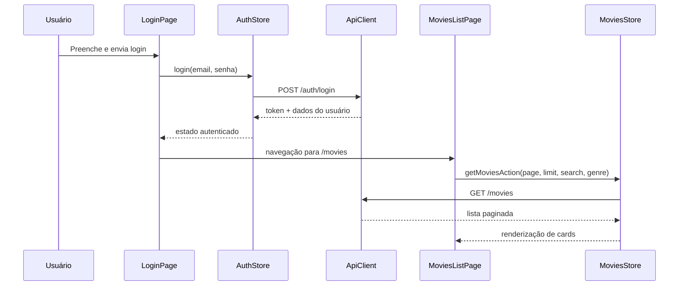

# Frontend - Cubos Movies Web

Aplicação SPA responsável por autenticação de usuário, listagem de filmes, detalhes, criação/edição e fluxos de recuperação de senha.

## Stack técnica

- React 19 + TypeScript
- Vite 8
- Estado global: Zustand
- Validação de payload/formulários: Zod
- Roteamento: React Router
- Notificações: Sonner
- Qualidade: ESLint + Vitest + TypeScript (`tsc --noEmit`)

## Organização de código

- `src/pages`: páginas de rota (login, cadastro, lista, detalhe, forgot/reset password, not found).
- `src/components`: componentes reutilizáveis de UI e autenticação.
- `src/store`: stores globais (`auth`, `movies`, `theme`).
- `src/lib`: cliente HTTP, schemas e utilitários.
- `src/types`: contratos tipados da aplicação.

## Rotas principais

- `/login`
- `/register`
- `/forgot-password`
- `/reset-password`
- `/movies`
- `/movies/:id`

## Tecnologias e responsabilidades

| Tecnologia   | Responsabilidade                                                |
| ------------ | --------------------------------------------------------------- |
| React        | Estrutura declarativa de UI e composição de páginas/componentes |
| React Router | Navegação client-side e proteção de rotas                       |
| Zustand      | Estado global de sessão, filmes e tema                          |
| Zod          | Validação de formulários e payloads no cliente                  |
| Vite         | Build e servidor de desenvolvimento com HMR                     |

## UML - visão estrutural (componentes e estado)



## UML - sequência do fluxo de login e listagem



## Como executar

### Pré-requisitos

- Node.js >= 20
- npm >= 10
- Backend da API rodando (padrão: `http://localhost:3000`)

### Instalação

```bash
npm install
```

### Desenvolvimento

```bash
npm run dev
```

### Build e preview

```bash
npm run build
npm run preview
```

## Scripts úteis

```bash
npm run dev
npm run build
npm run lint
npm run test
npm run test:watch
npx tsc --noEmit
```

## Melhorias de UX implementadas

- Link de criação de conta na tela de login.
- Ícone de visibilidade em campos de senha.
- Fluxo completo de esqueci/minha senha com páginas dedicadas.
- Cards de filmes com ano, duração e gênero para decisão rápida.
- Ajustes visuais de background para transição mais suave em diferentes larguras de tela.

## Observações técnicas

- O frontend consome endpoints autenticados com Bearer token.
- As validações de dados de entrada são feitas antes das requisições.
- Filtros complementares de data e duração são aplicados no cliente para melhorar experiência de busca.
